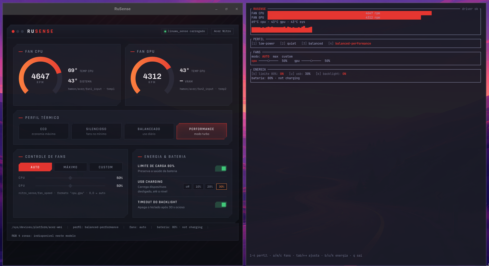

# RuSense

NitroSense/AcerSense para Linux, em Rust — TUI e GUI sobre o driver [Linuwu-Sense](https://github.com/0x7375646F/Linuwu-Sense).

Controle de perfis térmicos, fans, bateria e energia para notebooks Acer Nitro/Predator, com dois frontends que compartilham o mesmo core: um TUI (`rusense`, ratatui) e uma janela nativa (`rusense-gui`, Tauri 2).

## Screenshots



*GUI (`rusense-gui`) e TUI (`rusense`) rodando num Acer Nitro V 15 real. Para testar sem hardware Acer:*

```sh
rusense --mock        # TUI simulado
rusense-gui --mock    # GUI simulada
```

## Funcionalidades

| Recurso | Status |
|---|---|
| Perfis térmicos (low-power / quiet / balanced / performance — lidos dinamicamente do driver) | ✅ |
| Fans: auto, max e custom por fan (CPU/GPU, 0–100%) | ✅ |
| Monitoramento: RPM dos fans, temperaturas CPU/GPU/sys, bateria (% + status) | ✅ |
| Limite de carga da bateria em 80% (battery limiter) | ✅ |
| USB offline charging (0/10/20/30%) | ✅ |
| Timeout do backlight do teclado | ✅ |
| UI capability-aware: o que o hardware não tem, a interface esconde | ✅ |
| RGB 4 zonas | fora de escopo na v0.1 (depende do driver expor `four_zoned_kb` no modelo) |

## Requisitos

- Driver **Linuwu-Sense** carregado: <https://github.com/0x7375646F/Linuwu-Sense>
- **Rust** (toolchain stable, via [rustup](https://rustup.rs))
- Para a GUI: **webkit2gtk-4.1** (Arch: `sudo pacman -S webkit2gtk-4.1`; Ubuntu/Debian: `libwebkit2gtk-4.1-dev` para compilar)

## Instalação

### Binário pronto (TUI) — sem instalar Rust

```sh
curl -LO https://github.com/r3nv-dev/rusense/releases/latest/download/rusense-v0.1.1-x86_64-unknown-linux-musl.tar.gz
tar xzf rusense-v0.1.1-*.tar.gz && cd rusense-v0.1.1-*/
sudo ./install.sh    # regra udev — sem ela o app fica em modo somente leitura
./rusense
```

Binário **estático** (musl): não depende de glibc nem de bibliotecas do sistema —
roda de Alpine a RHEL 8. Verifique a integridade com o `.sha256` publicado junto,
ou a proveniência do build com:

```sh
gh attestation verify rusense-v0.1.1-*.tar.gz --repo r3nv-dev/rusense
```

A GUI ainda não tem binário pronto (Tauri depende do webkit2gtk do sistema, que
varia por distro) — para ela, siga o build abaixo.

## Build a partir do código

```sh
cargo build --release
```

Binários em `target/release/`:

- `target/release/rusense` — TUI
- `target/release/rusense-gui` — GUI

Ou instale os dois direto no PATH (`~/.cargo/bin`):

```sh
cargo install --path tui && cargo install --path gui
```

Para liberar escrita nos controles do driver (perfis, fans, energia) sem rodar o app como root, instale a regra udev:

```sh
sudo ./install.sh
```

Sem a regra os apps funcionam normalmente em **modo somente leitura** (monitoramento) — e avisam como corrigir ao tentar escrever. Para desinstalar a regra, o `install.sh` imprime os passos de undo ao final.

## Uso

### TUI (`rusense`)

```sh
rusense          # driver real
rusense --mock   # backend simulado, roda em qualquer máquina
```

| Tecla | Ação |
|---|---|
| `1`–`9` | Seleciona perfil térmico |
| `a` / `m` / `c` | Fans: auto / max / custom |
| `Tab` | Alterna foco entre slider CPU e GPU (modo custom) |
| `←` / `→` | Ajusta o slider focado (fora do modo custom, o primeiro toque já engaja o custom) |
| `b` | Liga/desliga limite de carga 80% |
| `u` | Cicla USB charging (0 → 10 → 20 → 30) |
| `k` | Liga/desliga timeout do backlight |
| `q` / `Esc` | Sai |

### `--once` — JSON para scripts (waybar & co.)

```sh
rusense --once
# {"fan_cpu_rpm":2348,"fan_gpu_rpm":2081,"temp_cpu":41.0,"temp_gpu":35.0,"temp_sys":40.0,"battery_pct":80,"battery_status":"Not charging"}
```

Exemplo de módulo custom no waybar (assume `rusense` no PATH via `cargo install`, acima):

```json
"custom/rusense": {
    "exec": "rusense --once | jq -r '\"\\(.temp_cpu | round)°C · \\(.fan_cpu_rpm) rpm · bat \\(.battery_pct)%\"'",
    "interval": 5
}
```

### Alerta de bateria baixa (opcional)

Um timer systemd de usuário notifica (uma vez por descida) quando a bateria fica abaixo de 20% descarregando — funciona mesmo sem TUI/GUI abertos:

```sh
cp dist/rusense-battery-alert.sh ~/.local/bin/rusense-battery-alert
cp dist/systemd/rusense-battery-alert.{service,timer} ~/.config/systemd/user/
systemctl --user daemon-reload
systemctl --user enable --now rusense-battery-alert.timer
```

Limiar configurável via `RUSENSE_BATTERY_THRESHOLD` (padrão 20). Requer `notify-send`.

### GUI (`rusense-gui`)

```sh
rusense-gui          # driver real
rusense-gui --mock   # backend simulado (ou RUSENSE_MOCK=1)
```

Janela nativa (Tauri 2 / webkit2gtk) com o mesmo conjunto de controles do TUI. No Hyprland abre como janela normal; se preferir flutuante: `windowrule = float, title:^(RuSense)$`.

## Arquitetura

Workspace Cargo com 3 crates em arquitetura hexagonal — o domínio não conhece UI nem sysfs:

```
rusense-tui ──┐
              ├──> rusense-core::SensePort (trait)  <── SysfsSense | MockSense
rusense-gui ──┘         (domínio puro, sem I/O nas structs)
```

- `core` — value objects validados (`FanDuty`, `FanMode`, `ProfileSet`, …), a porta `SensePort`, o adaptador real `SysfsSense` (base path injetável, testado com sysfs fake via `tempfile`) e o `MockSense`.
- `tui` / `gui` — adaptadores de apresentação; nunca tocam sysfs direto.
- Capacidades detectadas em runtime por existência de arquivo (nada de hardcode por modelo).

**106 testes** cobrem o projeto (57 core + 37 tui + 12 gui), todos rodando sem hardware — o `MockSense` permite contribuir de qualquer máquina, sem ter um Acer.

## Compatibilidade

- **Testado:** Acer Nitro V 15 (ANV15-52).
- **Esperado funcionar:** outros Nitro suportados pelo Linuwu-Sense (mesmo layout `nitro_sense/`).
- **Predator:** a regra udev já cobre `predator_sense/`; suporte funcional no app fica para uma versão futura.

## Créditos

- [Linuwu-Sense](https://github.com/0x7375646F/Linuwu-Sense) (0x7375646F) — o driver que torna tudo isso possível.
- Prior art: [kleqing/AcerSense](https://github.com/kleqing/AcerSense), [PXDiv/Div-Acer-Manager-Max](https://github.com/PXDiv/Div-Acer-Manager-Max), [VictorhMalheiro/electron-nitro-sense](https://github.com/VictorhMalheiro/electron-nitro-sense).

Projeto **não-oficial**, sem qualquer afiliação com a Acer. "NitroSense", "AcerSense", "Nitro" e "Predator" são marcas dos seus respectivos donos.

## Licença

[GPL-3.0](LICENSE) — mesmo espírito do driver.
